# System Architecture — Construction Safety Monitor

## Table of Contents

1. [System Overview](#1-system-overview)
2. [Inference Pipeline](#2-inference-pipeline)
3. [PPE Association Logic](#3-ppe-association-logic)
4. [Safety Rule Application](#4-safety-rule-application)
5. [Compliance Scoring](#5-compliance-scoring)
6. [Scene Classification](#6-scene-classification)
7. [Annotation Rendering](#7-annotation-rendering)
8. [Dataset Pipeline](#8-dataset-pipeline)
9. [Dataset Manipulation Methods](#9-dataset-manipulation-methods)
10. [Dataset Validation](#10-dataset-validation)

---

## 1. System Overview

The system has two independent pipelines: a **dataset pipeline** (offline, runs once) and an
**inference pipeline** (online, runs per frame). They share the 6-class schema and the
`rules.yaml` threshold file but are otherwise fully decoupled.

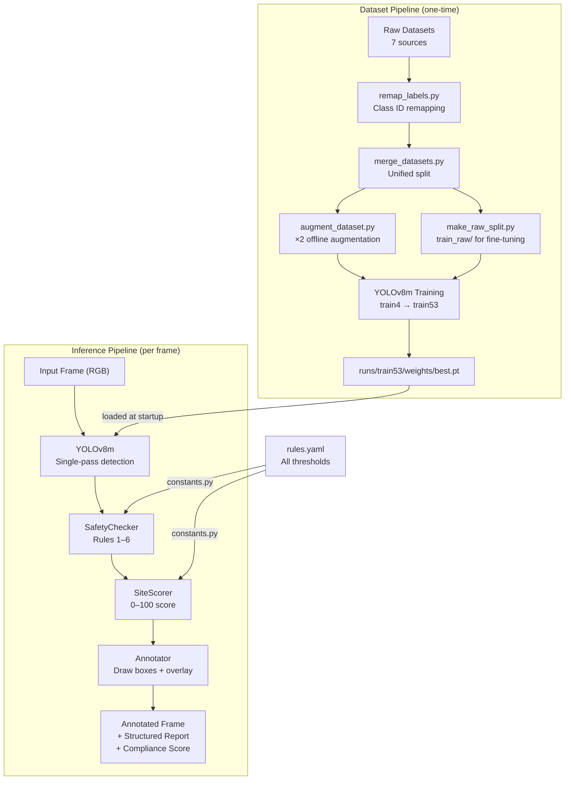

**Design principle:** `SafetyChecker` never calls YOLO. `SiteScorer` never applies rules.
`Annotator` has no inference logic. `pipeline.py` is the only file that knows about all of them.

---

## 2. Inference Pipeline

The pipeline runs YOLO once on the full frame and returns all detection boxes simultaneously.
`SafetyChecker` then associates PPE boxes to person boxes by geometry — no second YOLO call.

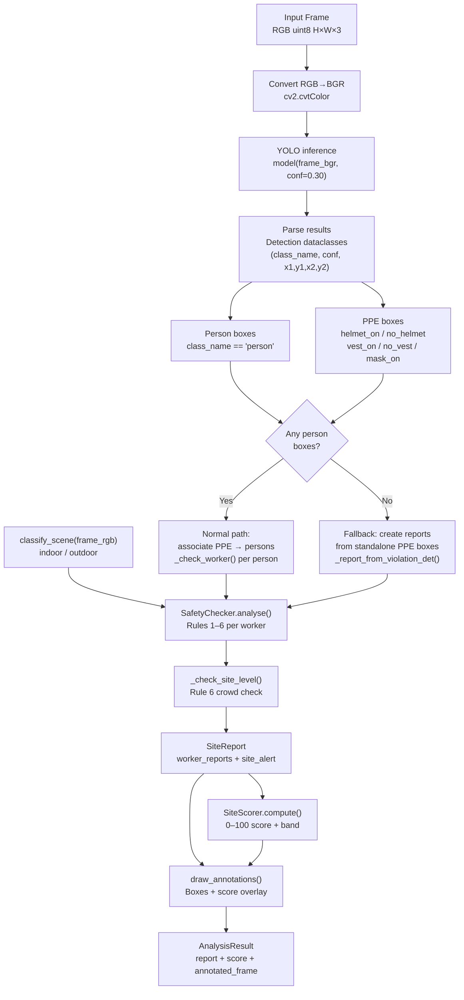

### `AnalysisResult` fields

| Field | Type | Description |
|---|---|---|
| `site_report` | `SiteReport` | Per-worker ViolationReports + site alert |
| `score_result` | `ScoreResult` | 0–100 score, band, violation counts |
| `annotated_frame` | `np.ndarray` | RGB frame with boxes drawn |
| `formatted_report` | `str` | Human-readable text report |
| `timestamp` | `float` | Unix timestamp of analysis |

---

## 3. PPE Association Logic

The core challenge: YOLO anchors the `person` box at the torso, so the head is often above
or at the top edge of the bounding box. A naïve IoU search misses helmet detections.
Three association strategies are used in order:

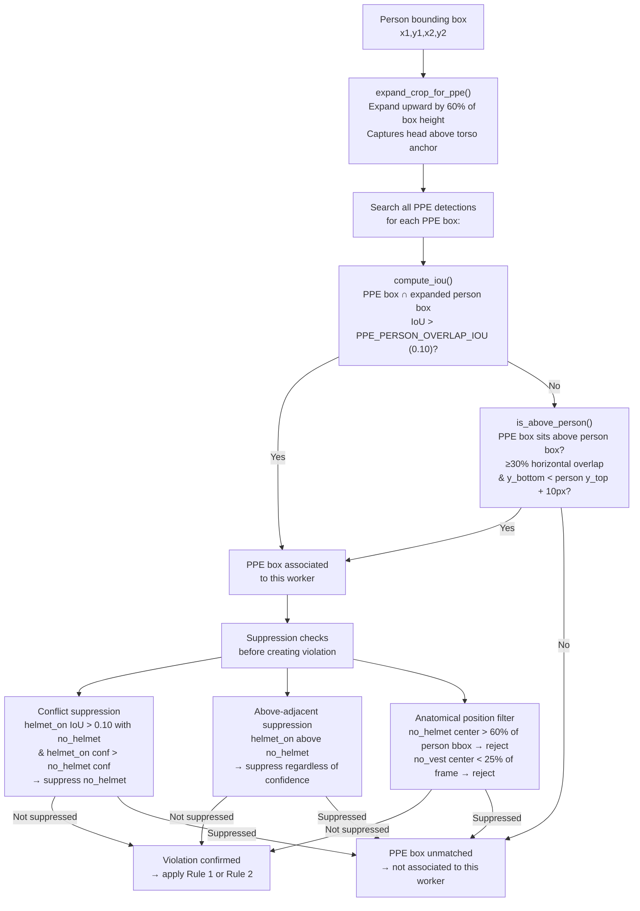

### `expand_crop_for_ppe(bbox, frame_height, frame_width)`

```
expanded_y1 = max(0, y1 − (y2 − y1) × PERSON_CROP_HEAD_EXPAND)
expanded_y1 = max(0, y1 − (y2 − y1) × 0.60)
```

Expands the person bounding box upward by 60% of its height. This captures helmet detections
that sit above the torso-anchored person box, which is the primary cause of missed `no_helmet`
detections in close-up scenes.

### `is_above_person(ppe_bbox, person_bbox)`

Fires when two conditions are both true:
1. The PPE box bottom edge is within 10px above the person box top edge
2. The horizontal overlap between the PPE box and person box is ≥ 30% of the PPE box width

This is intentionally independent of confidence — spatial position is definitive evidence
that a helmet sits above a person. A mislocalized `no_helmet` box at high confidence is
suppressed when a `helmet_on` box sits above it, because the spatial layout is physically
unambiguous.

### `compute_iou(box_a, box_b)`

Standard intersection-over-union for two `(x1, y1, x2, y2)` boxes:

```
intersection = max(0, min(x2a, x2b) − max(x1a, x1b)) × max(0, min(y2a, y2b) − max(y1a, y1b))
union = area_a + area_b − intersection
IoU = intersection / union
```

---

## 4. Safety Rule Application

`_check_worker()` applies Rules 1–5 in sequence for each detected person.

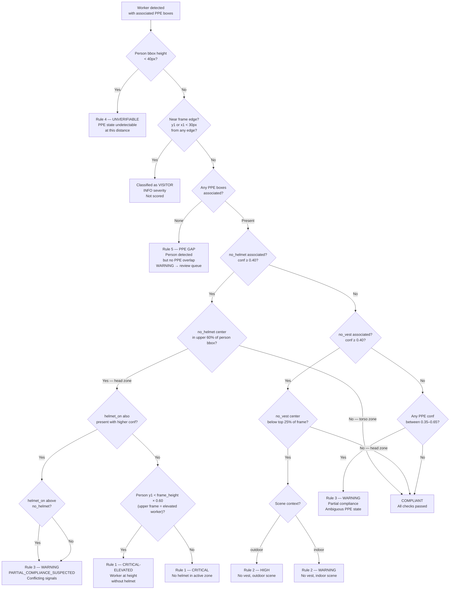

### Rule 6 — Site-Level Crowd Check (`_check_site_level`)

Runs after all per-worker reports are generated:

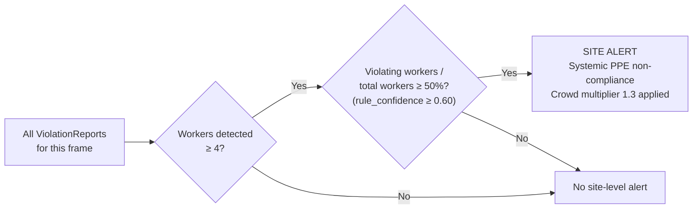

### `compute_rule_confidence(detection_conf, bbox_height, bbox_x_center, frame_width)`

A composite signal that is more trustworthy than raw YOLO confidence:

```
rule_confidence = (WEIGHT_DETECTION_CONF × detection_conf)
                + (WEIGHT_BBOX_SIZE       × min(1.0, bbox_height / 80))
                + (WEIGHT_EDGE            × (1.0 − edge_proximity_ratio))

Weights: 0.60 + 0.25 + 0.15 = 1.00

edge_proximity_ratio = min(bbox_x_center, frame_width − bbox_x_center) / (frame_width / 2)
```

| Tier | Threshold | Action |
|---|---|---|
| HIGH | ≥ 0.70 | Immediate alert |
| MEDIUM | 0.45–0.69 | Review queue |
| LOW | < 0.45 | Logged only |

---

## 5. Compliance Scoring

`SiteScorer.compute()` aggregates all ViolationReports into a single 0–100 score.

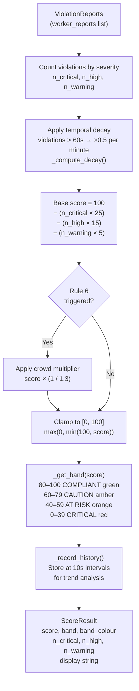

**Temporal decay:** Violations timestamped at detection time. For video, old violations
gradually reduce their score impact rather than snapping to zero, giving a smooth signal
that reflects sustained non-compliance rather than instantaneous frame state.

**Trend analysis (`get_trend_summary`):** Computes mean, minimum, and standard deviation
over `score_history` and returns a human-readable summary (e.g., "Average 74/100, minimum
43/100 — site in CAUTION band for this session").

---

## 6. Scene Classification

`classify_scene(frame_rgb)` determines indoor vs. outdoor context for Rule 2 severity.

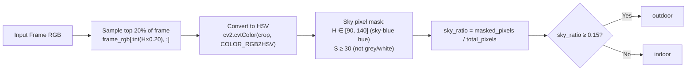

**Why a heuristic, not a model:** Sky blue in HSV space is a stable, high-specificity signal
on construction sites. The alternative — a separate scene-classification model — would add
weight, latency, and a second inference call for negligible accuracy gain. The heuristic has
zero cost, is deterministic, and is sufficient for the sole purpose it serves: modulating
Rule 2 severity between HIGH (outdoor) and WARNING (indoor).

---

## 7. Annotation Rendering

`draw_annotations()` is the final stage — it reads ViolationReports and draws on the frame
without any inference logic.

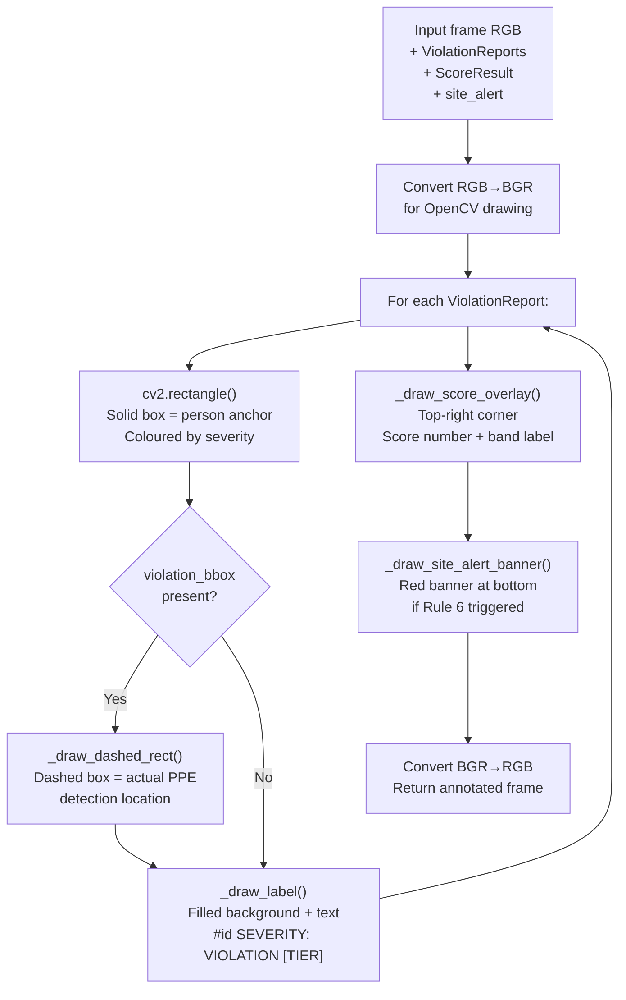

### Colour Convention

| Colour | BGR Value | Used For |
|---|---|---|
| Green `#00AA44` | (68, 170, 0) | COMPLIANT workers |
| Red `#FF2200` | (0, 34, 255) | CRITICAL / CRITICAL-ELEVATED |
| Orange `#FF6600` | (0, 102, 255) | HIGH severity |
| Yellow `#FFCC00` | (0, 204, 255) | WARNING / review queue |
| Blue `#4488FF` | (255, 136, 68) | Visitors |
| Dark red | (0, 0, 200) | SITE ALERT banner |

### Solid box vs. dashed box

- **Solid box** — drawn at the person bounding box. This is the anchor. It tells the viewer
  which worker the report refers to.
- **Dashed box** — drawn at `violation_bbox`, the coordinates of the actual `no_helmet` or
  `no_vest` detection. This shows exactly where the model saw the violation, allowing a
  human reviewer to verify whether the detection is plausible or a false positive.

### `_draw_dashed_rect()`

Draws a dashed rectangle by decomposing each side into alternating filled/gap segments:

```
For each side (4 edges):
  steps = length // (dash_len × 2)
  For each step i:
    t0 = i × 2 × dash_len / length        (dash start)
    t1 = (i × 2 + 1) × dash_len / length  (dash end)
    cv2.line(img, interpolated_start, interpolated_end, colour, 1)
```

---

## 8. Dataset Pipeline

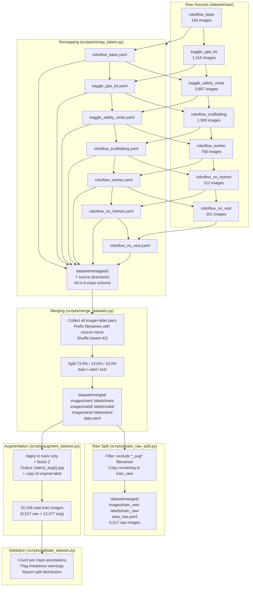

---

## 9. Dataset Manipulation Methods

### `remap_labels.py` — Class ID Remapping

Walks every `.txt` label file in a source dataset and rewrites class IDs using a mapping YAML.

**Mapping YAML format (`dataset/mappings/roboflow_worker.yaml`):**
```yaml
0: 4    # not-working → person
1: 4    # working → person
```

A value of `-1` discards the annotation. Classes not present in the YAML are also discarded.

**Supported directory layouts:**
```
Layout 1 (split at root):        Layout 2 (images/ + labels/):     Layout 3 (flat):
source/train/images/              source/images/train/               source/images/
source/train/labels/              source/labels/train/               source/labels/
source/valid/images/              source/images/valid/
source/valid/labels/              source/labels/valid/
```

`find_dataset_roots()` auto-detects the layout before remapping.

**Per-class reporting:** `remap_file()` tracks source class counts and destination class counts
and logs a before/after table per split so the engineer can verify the mapping is correct.

---

### `merge_datasets.py` — Multi-Source Merge

Merges N remapped source directories into one unified dataset with a clean train/val/test split.

```mermaid
flowchart LR
    SRC["N remapped\nsource directories"]
    COLLECT["collect_pairs(source)\nFind all (image, label) pairs\nHandle split and flat layouts"]
    PREFIX["Prefix filenames with source name\nkaggle_ppe_kit_img001.jpg\nPrevents filename collisions"]
    SHUFFLE["random.shuffle(seed=42)\nReproducible ordering"]
    SPLIT_MERGE["Split by ratio\nval_split=0.15, test_split=0.10\nRemainder → train"]
    COPY["safe_copy()\nCopy image + label\nCreate parent dirs if needed"]
    YAML["Write data.yaml\nYOLO format with absolute paths\n6 class names"]
    WARN["Warn if no_helmet or no_vest\n< 2,000 annotations in train"]

    SRC --> COLLECT --> PREFIX --> SHUFFLE --> SPLIT_MERGE --> COPY --> YAML --> WARN
```

**Duplicate stem handling:** If two sources produce the same filename after prefixing,
`merge_datasets.py` appends an incrementing counter (`_1`, `_2`) to the stem.

**`count_annotations(label_path)`:** Reads a single YOLO `.txt` file and returns a
`Counter` of class IDs. Used for the post-merge distribution report.

---

### `make_raw_split.py` — Fine-Tuning Split

Creates `train_raw/` by copying only non-augmented files from `train/`.

**Filter logic:**
```python
if "_aug" not in image_path.name:
    copy image → train_raw/images/
    copy label → train_raw/labels/
```

This is a one-way copy — `train_raw/` is always regenerated from `train/` and never
modified directly. Run after every re-merge.

---

### `augment_dataset.py` — Offline Augmentation

Applies to `train/` only. Each augmented copy gets a new label file (identical to the original,
since all augmentations except horizontal flip are label-preserving).

**Horizontal flip label correction:**
```
For each annotation line: class cx cy w h
Flipped cx = 1.0 − cx
All other fields unchanged
```

**Augmentation pipeline per copy:**
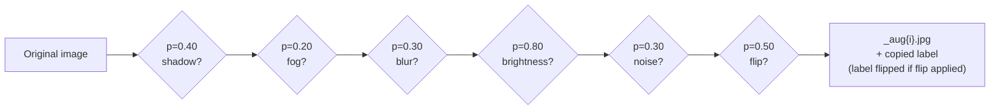

Each augmentation is applied independently — multiple augmentations can combine on a single
copy. A copy that hits all six probabilities will have shadow + fog + blur + brightness
adjustment + noise + horizontal flip applied simultaneously.

---

## 10. Dataset Validation

### `validate_dataset.py` — Class Distribution Audit

Counts annotations across all splits and reports against class targets.

**Validation rules enforced:**
1. `no_vest` count vs `no_helmet` count imbalance must be ≤ 20%
2. Combined violation class ratio (`no_helmet` + `no_vest`) must be ≥ 28%

**Output format:**
```
Split Distribution
--------------------------------
 Split - Images - Annotations
--------------------------------
 train - 6517   - 19794
 valid - 1325   - 3245
 test  - 883    - 2600
--------------------------------

Class Distribution (all splits)
--------------------------------------------------------
 Class     - Annotations - %     - Target - Delta
--------------------------------------------------------
 helmet_on - 3350        - 16.9% - 860    - 2490
 no_helmet - 1835        - 9.3%  - 680    - 1155
 vest_on   - 7095        - 35.8% - 770    - 6325
 no_vest   - 2702        - 13.7% - 500    - 2202
 person    - 3726        - 18.8% - 940    - 2786
 mask_on   - 1086        - 5.5%  - 120    - 966
--------------------------------------------------------
Imbalance Warnings:
  WARNING: no_vest/no_helmet imbalance = 47% — target ≤ 20%
  WARNING: violation class ratio 23.0% below target 31%
```

**Note on targets:** The `TARGET` column reflects initial planning targets, not hard
requirements. The actual distribution is determined by available public data. Deviations
are documented and compensated at training time via `cls=1.5` class loss weighting.

---

### `full_stats.py` — Per-Source Breakdown

Provides a source-by-source view of annotation counts in the raw (pre-merge) datasets.
Useful for diagnosing which source is responsible for a class imbalance.

**Output sections:**
1. **Source breakdown** — per-source image count and per-class annotation count before merge
2. **Merged dataset** — per-split breakdown with raw vs. augmented image counts and class
   distribution with ASCII bar charts
3. **Dataset health** — global metrics: violation ratio, no_helmet/no_vest imbalance,
   person annotation count, val/train and test/train ratios

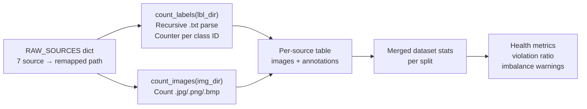

---

*All inference thresholds referenced above are defined in `rules.yaml` and loaded via
`inference/constants.py`. No magic numbers appear in inference code.*
