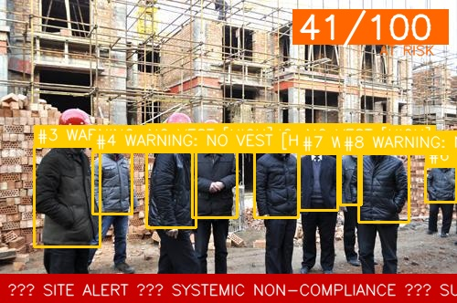
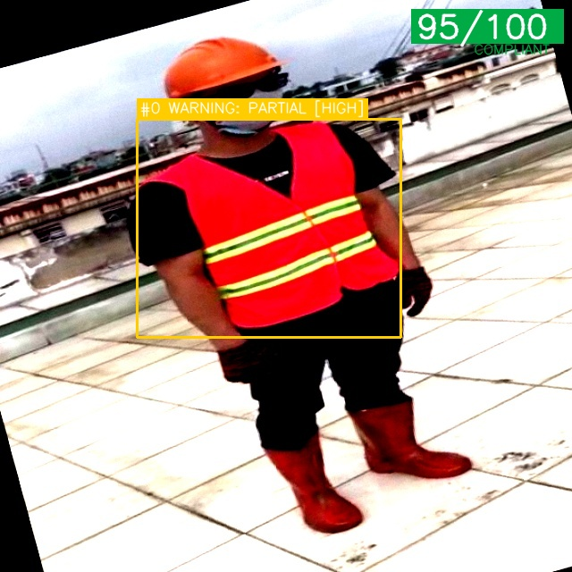
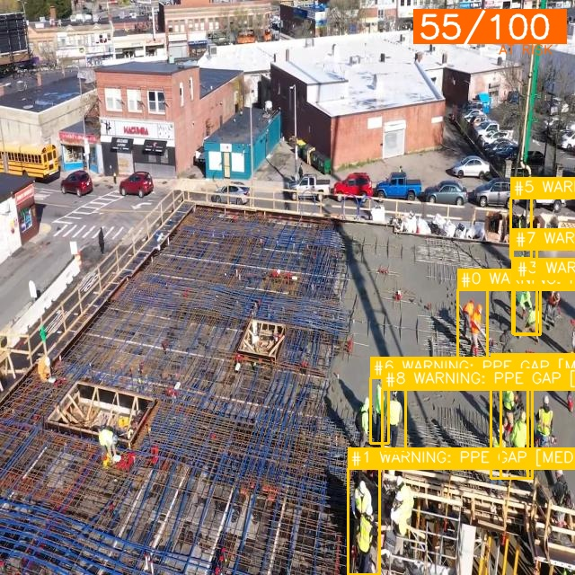

# Safety Rules Definition

## Overview

This document defines the 6 formal safety rules applied by the Construction Safety Monitor,
plus the suppression logic that prevents mislocalized detections from generating false alerts.

Each rule is specified with a precise, machine-checkable condition — not a vague description.
The design philosophy is: **express appropriate uncertainty rather than force a binary answer
when the evidence is ambiguous**. The system flags what it knows, admits what it doesn't, and
escalates only when confidence warrants it.

All thresholds referenced below are defined in `rules.yaml` and loaded via `inference/constants.py`.
No magic numbers appear in inference code.

---

## Rule 1 — No Helmet in Active Zone

**Formal condition:**
`no_helmet` detection associated with a person bounding box with YOLO confidence ≥ 0.40,
where person bbox height ≥ 40px in a 640px input frame, AND the `no_helmet` box center is
in the upper 60% of the person bbox (anatomical position filter).

**Severity:** CRITICAL

**Severity escalation:**
If the person bounding box top edge (`y1`) is located in the upper 60% of the frame
(i.e. `y1 < frame_height × 0.60`), escalate severity to **CRITICAL-ELEVATED** —
indicating the worker is likely at height (scaffolding, elevated platform).

**What counts as a violation:**
- Worker on site floor or scaffolding with visible head and `no_helmet` detected
- Confidence ≥ 0.40 and person bounding box height ≥ 40px
- `no_helmet` box center in upper 60% of person bbox (not torso/vest region)

**What does NOT count:**
- Person bounding box height < 40px — far-field, classified as UNVERIFIABLE (Rule 4)
- Person detected at site perimeter (within 30px of frame edge) — classified as VISITOR
- `no_helmet` box center in lower half of person bbox — anatomically impossible, rejected
- `helmet_on` detected directly above the `no_helmet` box — above-adjacent suppression fires

**Rationale:**
Head injuries are the leading cause of construction fatalities globally.
A worker at height without head protection represents the highest-risk PPE failure.

**Example — Rule 1 CRITICAL (no helmet, site floor):**


**Example — Rule 1 CRITICAL-ELEVATED (no helmet + no vest, elevated position):**


---

## Rule 2 — No High-Visibility Vest (Context-Aware)

**Formal condition:**
`no_vest` detection associated with a person bounding box with YOLO confidence ≥ 0.40,
AND the `no_vest` box center is below the top 25% of the frame (not in the head zone).

**Severity (outdoor scene):** HIGH
**Severity (indoor scene):** WARNING

**Scene classification method:**
A heuristic examines the top 20% of the input frame in HSV colour space.
If ≥ 15% of sampled pixels fall in the sky-blue hue range (H: 90–140) with
saturation ≥ 30, the frame is classified as **outdoor**. Otherwise **indoor**.

This is a deliberate heuristic choice — zero additional model weight, zero inference cost,
and sufficiently accurate for risk modulation purposes.

**What counts as a violation:**
- Worker in active zone without hi-vis vest, confidence ≥ 0.40
- `no_vest` box center below the top 25% of frame (vest is never on the head)

**What does NOT count:**
- Worker near site perimeter (visitor heuristic)
- `no_vest` box center in upper 25% of frame — anatomically impossible, rejected
- `vest_on` detected overlapping or adjacent to `no_vest` with higher confidence — suppressed

**Rationale:**
Hi-vis vests protect workers from vehicle and machinery strike.
Risk is context-dependent — outdoor means vehicle exposure; indoor means lower but non-zero risk.

**Example — Rule 2 (multiple workers, no vest):**



---

## Rule 3 — Partial Compliance (Low-Confidence Ambiguity)

**Formal condition:**
Any PPE item detected (helmet or vest) where the YOLO confidence is
between 0.35 and 0.65 (inclusive).

**Severity:** WARNING

**Output:** Flag as `PARTIAL_COMPLIANCE_SUSPECTED`. Add to human review queue.
Do not generate a CRITICAL or HIGH alert.

**What this detects:**
Vest worn open, helmet not fastened, PPE partially removed — conditions where
the model sees something PPE-shaped but cannot confirm it is correctly worn.

Also fires when **conflicting PPE signals** are detected on the same worker:
- `helmet_on` and `no_helmet` both overlap the same worker and `helmet_on` outscores
  `no_helmet` — the model is contradicting itself. Downgraded to WARNING review rather
  than escalated to CRITICAL.

**Rationale:**
Partial compliance is a real safety risk but cannot be reliably confirmed by
a detection model alone. The honest response is to flag uncertainty, not guess.

**Example — Rule 3 (borderline confidence, review queue):**



---

## Rule 4 — Far-Field Worker Unverifiable

**Formal condition:**
Person detected with bounding box height < 40px in a 640px input
(approximately 6% of frame height — worker too distant to classify PPE reliably).

**Severity:** UNVERIFIABLE (capability flag — not a violation flag)

**Output:** `PPE_STATE_UNVERIFIABLE — worker at distance, PPE cannot be assessed.`

**What this prevents:**
- Silently treating undetectable workers as compliant (dangerous — false safety)
- Flagging them as violations (alert fatigue — false alarm)

The system admits its limit rather than guessing in either direction.

---

## Rule 5 — Occlusion / Detection Gap

**Formal condition:**
Person bounding box detected, but no PPE bounding boxes are associated with the person
after the full association search (IoU + above-adjacent + is_above_person checks).

**Severity:** WARNING

**Output:** `PPE detection failed for worker — possible occlusion or detection gap.
Human review recommended.`

**What this prevents:**
A false negative from the PPE detector silently passing as "compliant."
The system flags the absence of evidence rather than treating it as evidence of compliance.

**Example — Rule 5 (workers detected, PPE unassociated):**



---

## Rule 6 — Site-Level Crowd Non-Compliance

**Formal condition:**
≥ 4 workers detected in a single frame AND ≥ 50% of detected workers have at least
one active violation (Rule 1 or Rule 2) with rule_confidence ≥ 0.60.

**Severity:** SITE ALERT (escalated from individual violation alerts)

**Output:**
```
[SITE ALERT] Systemic PPE non-compliance detected
  Workers detected: N
  Workers non-compliant: X (Y%)
  Active violations: no_helmet ×N, no_vest ×N
  Compliance score: Z/100 — CRITICAL
  Recommended action: Site-wide work stoppage for PPE briefing.
```

**Crowd multiplier:**
When Rule 6 triggers, the compliance score deduction is multiplied by 1.3.

**Example — Rule 6 (site alert, systemic non-compliance):**


---

## Suppression Logic

Beyond the six rules, the system applies three suppression filters to prevent mislocalized
YOLO detections from generating false alerts. These are particularly important in the fallback
path (when no person box is detected and reports are derived from standalone PPE boxes).

### Suppression 1 — Conflict Resolution (IoU overlap)

When `helmet_on` and `no_helmet` overlap the same region with IoU > 0.10 and
`helmet_on` confidence exceeds `no_helmet` confidence, the violation is suppressed.
Same logic for `vest_on` vs `no_vest`.

**Example:** Model outputs `helmet_on: 0.82` and `no_helmet: 0.41` on the same head region.
`no_helmet` is suppressed. If both are borderline, downgraded to `partial_compliance` WARNING.

### Suppression 2 — Above-Adjacent (spatial evidence)

When `helmet_on` sits directly above a `no_helmet` box with ≥ 30% horizontal overlap,
the `no_helmet` is suppressed regardless of confidence ordering.

**Why confidence is ignored here:** The model sometimes produces a mislocalized `no_helmet`
box at the torso/vest region with high confidence, while `helmet_on` appears at the correct
head location with slightly lower confidence. The spatial layout (helmet above body) is
physically definitive — the helmet exists. Confidence ordering is not trustworthy when
the spatial evidence is unambiguous.

**Example:** `helmet_on: 0.75` at y=0–30, `no_helmet: 0.81` at y=80–300 on same horizontal
column. The helmet is there. The `no_helmet` box is mislocalized on the torso. Suppressed.

### Suppression 3 — Anatomical Position Filter

Violations are rejected when their bounding box is in an anatomically impossible location:

| Violation | Rejected when |
|---|---|
| `no_helmet` | box center below 60% of person bbox height (torso/vest zone) |
| `no_helmet` (fallback) | box center below 60% of frame height |
| `no_vest` (fallback) | box center above 25% of frame height (head zone) |

**Example:** Model outputs `no_vest: 0.44` with box center at y=35 in a 640px frame (top 5%).
That is the head region. A vest is never on a head. Rejected before creating a violation report.

---

## Rules Configuration (`rules.yaml`)

All thresholds are defined in `rules.yaml` at the project root.
`SafetyChecker` loads them via `inference/constants.py` at import time.
A safety engineer can audit and adjust all thresholds without reading any Python code.

Key thresholds:
```yaml
detection:
  violation_conf_min: 0.40             # lowered from 0.50 — recovers ~7% recall on no_helmet
  partial_compliance_conf_low: 0.35
  partial_compliance_conf_high: 0.65

bbox:
  far_field_height_px: 40
  ppe_person_overlap_iou: 0.10
  person_crop_head_expand: 0.60        # expand person bbox upward 60% for PPE search
  ppe_above_person_x_overlap: 0.30    # min horizontal overlap for above-adjacent association
  no_helmet_max_body_fraction: 0.50   # no_helmet center must be in upper 50% of person box

frame:
  elevation_zone_ratio: 0.60
  visitor_edge_px: 30

crowd:
  min_workers: 4
  violation_ratio_threshold: 0.50
  crowd_violation_conf_min: 0.60
```

---

## Rule Summary Table

| Rule | Trigger | Severity | Output Type |
|---|---|---|---|
| 1 — No helmet | `no_helmet` conf ≥ 0.40, bbox ≥ 40px, head region | CRITICAL | Alert |
| 1 (elevated) | same, upper 60% of frame | CRITICAL-ELEVATED | Alert |
| 2 — No vest (outdoor) | `no_vest` conf ≥ 0.40, outdoor, not head zone | HIGH | Alert |
| 2 — No vest (indoor) | `no_vest` conf ≥ 0.40, indoor, not head zone | WARNING | Log |
| 3 — Partial / conflict | PPE conf 0.35–0.65 or conflicting signals | WARNING | Review queue |
| 4 — Far-field | Person bbox height < 40px | UNVERIFIABLE | Info flag |
| 5 — Occlusion gap | Person detected, no PPE associated | WARNING | Review queue |
| 6 — Crowd | ≥ 4 workers, ≥ 50% violating | SITE ALERT | Escalated alert |
